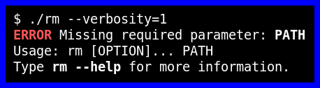

[](https://maven-badges.herokuapp.com/maven-central/com.github.h908714124/jbock-annotations)
[](https://maven-badges.herokuapp.com/maven-central/com.github.h908714124/jbock)

jbock is a command line parser, similar to [JCommander](https://jcommander.org/)
and [picocli](https://github.com/remkop/picocli).
It is an
[annotation processor](https://openjdk.java.net/groups/compiler/processing-code.html)
that generates custom parsing code at compile time.

Please see the [wiki](https://github.com/h908714124/jbock/wiki) for synopsis details.

### Basic example

A command line interface is defined as an `abstract` class 
which has either a `@Command` or `@SuperCommand` annotation.
In this class, each `abstract` method defines a *named option* or a *positional parameter*.

````java
@Command(name = "rm", description = "Coffee time!")
abstract class DeleteCommand {

  /* Path, not Optional<Path>:
   * This positional parameter is required.
   */
  @Parameter(index = 0,
             description = "A positional parameter.")
  abstract Path path();

  /* OptionalInt, not int or Integer:
   * This named option is optional.
   */
  @Option(names = {"-v", "--verbosity"},
          description = "A named option.")
  abstract OptionalInt verbosity();
}
````

See here for the code this generates:
[DeleteCommandParser.java](https://github.com/h908714124/jbock-docgen/blob/master/src/main/java/com/example/hello/DeleteCommandParser.java)

The generated code is typically used directly in the `main` method:

````java
public static void main(String[] args) {
    DeleteCommand command = new DeleteCommand_Parser().parseOrExit(args);
    // ...
}

````

This will be enough to warn your users of missing parameters,
in a nicely colored error message:



### Sample projects

* [jbock-maven-example](https://github.com/h908714124/jbock-maven-example)
* [jbock-gradle-example](https://github.com/h908714124/jbock-gradle-example)
